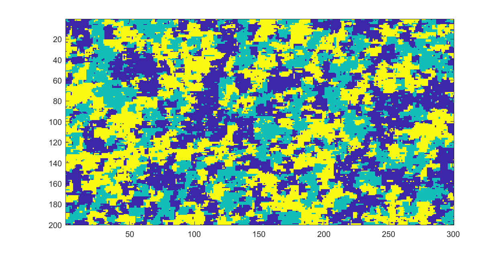
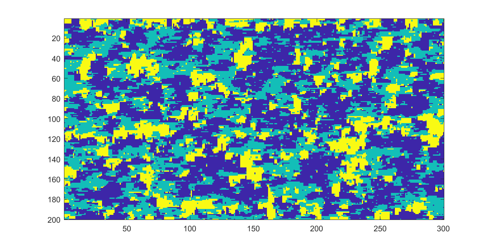

# TransitionProbabilityGeostatistics

Prototype of an algorithm for facies geostatistical simulation based on transition probabilities. 

The current version simulates only 2D facies realizations and the transition probabilities are limited by a first order Markov model (i.e. only first neighbors are accounted depending on transitions matrices).

## Examples

The transition probabilities of the transition matrices are the main parameter of this methodology. 
For isotropic simulations, the vertical transition matrix is defined as equal to the horizontal transition matrix. 
For anisotropic simulations, the vertical and horizontal matrices are different. 

For the vertical transition matrix, the algorithm allows the use of asymmetric matrices. That is an interesting feature when simulating
facies since the user can prohibit some transitions as a way to include geological constraints. 

### Isotropic Simulation

### Anisotropic Simulation

